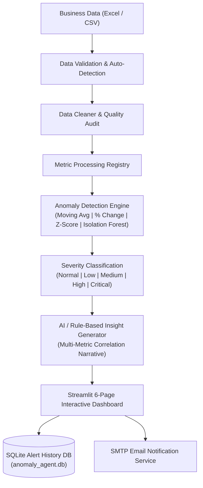

# AI Anomaly Agent for Business Metrics 🤖📊

An intelligent, end-to-end business analytics monitoring platform that ingests Excel/CSV business metrics data, automatically identifies key performance indicators, cleans dataset issues, detects multi-metric anomalies using statistical and machine learning techniques, generates natural language business explanations, logs alerts in SQLite, and dispatches automated SMTP email notifications.

---

## 🌟 Key Features

- 📁 **Multi-Format Ingestion**: Supports `.xlsx` and `.csv` business dataset uploads.
- 🧹 **Automated Data Quality Audit**: Auto-detects dates, numeric metrics, missing values, duplicates, and invalid data types.
- ⚡ **4 Advanced Anomaly Detection Algorithms**:
  1. **Percentage Change**: Instant relative shift comparison.
  2. **Moving Average (Rolling Mean)**: Baseline trend window comparison.
  3. **Z-Score**: Statistical standard deviation bounds.
  4. **Isolation Forest**: Unsupervised Machine Learning anomaly scoring via Scikit-Learn.
- 🎯 **Dynamic Severity Classification**: Normal (0-10%), Low (10-20%), Medium (20-30%), High (30-50%), Critical (>50%).
- 🧠 **Multi-Metric Intelligence Layer**: Generates root-cause business hypotheses considering relationships (e.g., Revenue down + Traffic steady + Conversion down -> Conversion issue).
- 🤖 **Executive Summary Engine**: Integrates Gemini / OpenAI API with automatic rule-based fallback for 3-6 sentence executive briefs.
- 📊 **6-Page Streamlit Dashboard**: Overview, Anomaly Monitor, Metric Trends, AI Insights, Alert History, Settings.
- 💾 **SQLite Alert Audit Trail**: Persistent database logging for historical queries and exports.
- 📧 **SMTP Email Alerts**: Configurable HTML email notifications for high-severity metrics with test connection triggers.

---

## 🏗️ System Architecture



---

## 🛠️ Tech Stack

- **Core & Processing**: Python 3.11, Pandas, NumPy
- **Machine Learning & Stats**: Scikit-Learn (Isolation Forest), SciPy
- **Dashboard UI**: Streamlit, Plotly Express & Graph Objects
- **Database**: SQLite3
- **Email & Alerts**: Python `smtplib`, `email.mime`
- **AI Integration**: Google Gemini API / OpenAI API (Optional with Rule-Based Fallback)
- **Testing & Tooling**: PyTest, Python-Dotenv, OpenPyXL

---

## 📈 Anomaly Detection Methods

### Method 1: Percentage Change
$$\text{Percentage Change} = \frac{\text{Current Value} - \text{Previous Value}}{\text{Previous Value}} \times 100$$

### Method 2: Moving Average (Rolling Mean)
$$\text{Baseline} = \frac{1}{N} \sum_{i=1}^{N} x_{t-i}$$
$$\text{Deviation \%} = \frac{x_t - \text{Baseline}}{\text{Baseline}} \times 100$$

### Method 3: Z-Score
$$Z = \frac{x_t - \mu_{\text{rolling}}}{\sigma_{\text{rolling}}}$$
Flags observations where $|Z| > \text{Threshold}$ (default 2.0).

### Method 4: Isolation Forest
Fits an unsupervised ensemble of decision trees (`sklearn.ensemble.IsolationForest`) to isolate anomalies across single or multi-variate feature spaces.

---

## 📁 Project Structure

```
ai-anomaly-agent/
├── app.py                      # Main Streamlit dashboard application
├── data/                       # Dataset directory (sample Excel & CSV)
│   ├── sample_business_data.xlsx
│   └── sample_business_data.csv
├── src/                        # Core backend source code
│   ├── __init__.py
│   ├── data_loader.py          # File reading & column auto-detection
│   ├── data_cleaner.py         # Data cleaning & quality audit
│   ├── anomaly_detector.py     # 4 Detection algorithms & severity
│   ├── insight_generator.py    # Multi-metric narrative & AI summary
│   ├── email_service.py        # SMTP email alert dispatching
│   ├── database.py             # SQLite persistence manager
│   └── metrics.py              # Metric registry & relationships
├── views/                      # Dashboard UI pages
│   ├── __init__.py
│   ├── overview.py             # Page 1: Key Metric Overview & Cards
│   ├── anomaly_monitor.py      # Page 2: Filterable Anomaly Table
│   ├── trends.py               # Page 3: Plotly Time-Series Charts
│   ├── ai_insights.py          # Page 4: Executive Briefings
│   ├── alert_history.py        # Page 5: Historical Database Audit
│   └── settings.py             # Page 6: System Configuration
├── database/                   # SQLite database directory
│   └── anomaly_agent.db
├── utils/                      # Helper & config utilities
│   ├── __init__.py
│   ├── config.py               # Environment & constants config
│   └── helpers.py              # Number formatting & HTML badges
├── scripts/                    # Helper scripts
│   └── generate_sample_data.py # 180-day sample data generator
├── tests/                      # PyTest unit testing suite
│   ├── test_data_loader.py
│   ├── test_anomaly_detector.py
│   ├── test_insight_generator.py
│   └── test_database.py
├── .env.example                # Environment variable template
├── requirements.txt            # Dependencies manifest
├── .gitignore                  # Git ignore rules
└── README.md                   # Complete documentation
```

---

## 🚀 Quick Start Guide

### 1. Clone & Setup Environment

```bash
# Navigate to directory
cd ai-anomaly-agent

# Create virtual environment (optional)
python -m venv venv
source venv/bin/activate  # On Windows: venv\Scripts\activate
```

### 2. Install Dependencies

```bash
pip install -r requirements.txt
```

### 3. Generate Sample Business Dataset

```bash
python scripts/generate_sample_data.py
```

### 4. Configure Environment Variables (Optional)

Copy `.env.example` to `.env` and set your credentials:

```bash
cp .env.example .env
```

### 5. Launch Dashboard Application

```bash
streamlit run app.py
```

Open your browser at `http://localhost:8501`.

---

## 🧪 Running Unit Tests

Run the full pytest suite to verify all detection algorithms and database operations:

```bash
pytest tests/
```

---

## 📧 Example Email Alert

```
Subject: [HIGH ALERT] Revenue Anomaly Detected (-24.75%)

AI Business Anomaly Monitor
Metric: Revenue
Current Value: ₹84,500.00
Expected Baseline: ₹112,300.00
Deviation: -24.75%
Severity: HIGH

Business Analysis:
Revenue dropped 24.75% compared with the 14-day average baseline.
Website traffic remained steady while conversion rate dropped by 18%.
This suggests the revenue decline may be related to weaker conversion
performance rather than lower traffic.

Recommended Check:
Review checkout funnel, payment gateway success rates, and recent pricing changes.
```

---

## 🔮 Future Enhancements

- 🔮 **Prophet & ARIMA Forecasting**: Incorporate time-series forecasting bounds.
- 🔔 **Slack & Webhook Integrations**: Support instant Slack/Teams webhooks.
- 🌐 **Rest API Endpoints**: FastAPI wrapper to trigger headless detection on cron.
